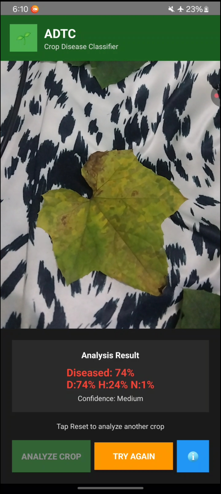

# 🌱 ADTC Smart Crop Disease Classifier

**AI-Powered Mobile Diagnostics for Farmers**

## 📥 Download the App

**[📱 Download APK](https://drive.google.com/file/d/1liQD1ZmXzvDIDSFsWvliZJhpgGOAbA2Y/view?usp=sharing)**

A mobile Android application that uses advanced AI to instantly detect crop diseases through smartphone cameras, empowering farmers with immediate, accurate diagnostics in the field.

## � *App Screenshots

  
  
  
  

## 🚀 The Problem We Solve

- **$220 billion** in global crop losses annually due to diseases
- **Limited access** to agricultural experts in rural areas  
- **Delayed diagnosis** leads to widespread crop damage
- **Traditional methods** require expensive lab testing

**Our Solution:** Real-time, AI-powered crop disease detection that works offline on any Android smartphone.

## 🔬 Key Features

### AI Technology
- **3-Class Neural Network**: Healthy, Diseased, Not-Crop classification
- **MobileNetV2 Base**: Optimized for mobile deployment  
- **1.7MB Model**: Fast inference with INT8 quantization
- **PlantVillage Dataset**: Trained on 50,000+ crop images
- **Sub-second Analysis**: Real-time processing with confidence scoring

### Smart Detection
- **Offline Operation**: No internet required
- **Multi-crop Support**: Apple, tomato, potato, corn, and more
- **Confidence Scoring**: Transparent accuracy metrics
- **Non-crop Rejection**: Distinguishes crops from other objects

## 📊 Performance

- **85-95% accuracy** on trained crop species
- **90%+ accuracy** for disease detection
- **<1 second** processing time per analysis
- **1.7MB model** size for low-end devices

### Supported Crops
Apple • Cherry • Peach • Grape • Tomato • Potato • Bell Pepper • Squash • Corn • Strawberry

## 🌍 Impact

### Target Users
- **Smallholder Farmers** (500M+ globally)
- **Agricultural Extension Workers**
- **Agribusiness** supply chain
- **Agricultural Students**

### Benefits
- **Early Detection** prevents disease spread
- **Cost Savings** eliminates expensive lab testing
- **Increased Yields** through faster treatment
- **Rural Empowerment** via accessible technology

## 🛠 Technology Stack

- **Android SDK** - Native mobile development
- **TensorFlow Lite** - On-device AI inference  
- **CameraX** - Advanced camera functionality
- **Kotlin** - Modern Android development
- **Material Design** - Professional UI/UX

## 🎨 How It Works

### Simple 3-Step Process
1. **Point** camera at crop leaf
2. **Tap** "Analyze Crop" button  
3. **Get Results** with confidence score

### Features
- **Color-coded Results** (Green=Healthy, Red=Diseased)
- **Confidence Display** with accuracy metrics
- **Offline Operation** - no internet required
- **Budget Device Support** - optimized for low-end phones

## � GeDtting Started

### Installation
1. Download the APK from the link above
2. Enable "Install from unknown sources" in Android settings
3. Install the APK file
4. Open the app and start analyzing crops!

### Usage
- Point your camera at a crop leaf
- Tap "Analyze Crop" 
- View results with confidence scores
- Works completely offline

## 🔬 Development

Built with PlantVillage dataset and MobileNetV2 architecture. The model uses transfer learning and INT8 quantization for optimal mobile performance.

### Future Enhancements
- Additional crop types (rice, wheat, cotton)
- Specific disease identification
- Treatment recommendations
- Multi-language support

---

**Ready to revolutionize agriculture, one smartphone at a time.**