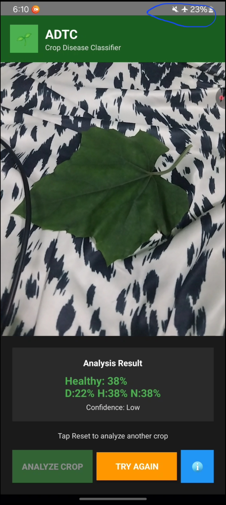

# 🌱 ADTC Smart Crop Disease Classifier

**AI-Powered Mobile Diagnostics for Farmers**

## 📥 Download the App

**[📱 Download APK](https://drive.google.com/file/d/1liQD1ZmXzvDIDSFsWvliZJhpgGOAbA2Y/view?usp=sharing)**

A mobile Android application that uses advanced AI to instantly detect crop diseases through smartphone cameras, empowering farmers with immediate, accurate diagnostics in the field.

## � *App Screenshots

  
  
  
  

## 🚀 The Problem We Solve

- **$220 billion** in global crop losses annually due to diseases
- **Limited access** to agricultural experts in rural areas  
- **Delayed diagnosis** leads to widespread crop damage
- **Traditional methods** require expensive lab testing

**Our Solution:** Real-time, AI-powered crop disease detection that works offline on any Android smartphone.

## 🔬 Key Features

### AI Technology
- **3-Class Neural Network**: Healthy, Diseased, Not-Crop classification
- **MobileNetV2 Base**: Optimized for mobile deployment  
- **1.7MB Model**: Fast inference with INT8 quantization
- **PlantVillage Dataset**: Trained on 50,000+ crop images
- **Sub-second Analysis**: Real-time processing with confidence scoring

### Smart Detection
- **Offline Operation**: No internet required
- **Multi-crop Support**: Apple, tomato, potato, corn, and more
- **Confidence Scoring**: Transparent accuracy metrics
- **Non-crop Rejection**: Distinguishes crops from other objects

## 📊 Performance

- **85-95% accuracy** on trained crop species
- **90%+ accuracy** for disease detection
- **<1 second** processing time per analysis
- **1.7MB model** size for low-end devices

### Supported Crops
Apple • Cherry • Peach • Grape • Tomato • Potato • Bell Pepper • Squash • Corn • Strawberry

## 🌍 Impact

### Target Users
- **Smallholder Farmers** (500M+ globally)
- **Agricultural Extension Workers**
- **Agribusiness** supply chain
- **Agricultural Students**

### Benefits
- **Early Detection** prevents disease spread
- **Cost Savings** eliminates expensive lab testing
- **Increased Yields** through faster treatment
- **Rural Empowerment** via accessible technology

## 🛠 Technology Stack

- **Android SDK** - Native mobile development
- **TensorFlow Lite** - On-device AI inference  
- **CameraX** - Advanced camera functionality
- **Kotlin** - Modern Android development
- **Material Design** - Professional UI/UX

## 🎨 How It Works

### Simple 3-Step Process
1. **Point** camera at crop leaf
2. **Tap** "Analyze Crop" button  
3. **Get Results** with confidence score

### **Professional Interface:**
- **ADTC Branding**: Professional agricultural theme
- **Visual Feedback**: Color-coded results (Green=Healthy, Red=Diseased)
- **Confidence Display**: Transparent accuracy metrics
- **Guidance**: Clear instructions and error messages

### **Accessibility Features:**
- **Offline Operation**: Works without internet
- **Low-End Device Support**: Optimized for budget phones
- **Multiple Languages**: Extensible for localization
- **Visual Indicators**: Color and text feedback

## 🔬 **Development Process**

### **Data Science Approach:**
1. **Dataset Curation**: PlantVillage + synthetic non-crop data
2. **Model Architecture**: MobileNetV2 with custom classification head
3. **Training Strategy**: Transfer learning + fine-tuning
4. **Optimization**: INT8 quantization for mobile deployment
5. **Validation**: Comprehensive testing across crop types

### **Software Engineering:**
1. **Mobile Development**: Native Android with modern architecture
2. **Image Processing**: Real-time camera integration
3. **AI Integration**: TensorFlow Lite deployment
4. **User Experience**: Iterative design and testing
5. **Performance Optimization**: Memory and battery efficiency

## 📈 **Scalability & Future Development**

### **Immediate Enhancements:**
- **Additional Crops**: Expand to rice, wheat, cotton, soybeans
- **Disease Specificity**: Identify specific disease types
- **Treatment Recommendations**: Suggest appropriate interventions
- **Multi-language Support**: Localization for global markets

### **Advanced Features:**
- **Cloud Sync**: Optional data backup and sharing
- **Expert Network**: Connect farmers with agricultural specialists
- **Historical Tracking**: Monitor crop health over time
- **IoT Integration**: Connect with farm sensors and equipment

### **Platform Expansion:**
- **iOS Version**: Expand to Apple ecosystem
- **Web Application**: Browser-based diagnostics
- **API Services**: Integration with agricultural platforms
- **Enterprise Solutions**: Large-scale farm management

## 💼 **Business Model & Sustainability**

### **Revenue Streams:**
- **Freemium Model**: Basic detection free, advanced features premium
- **Enterprise Licensing**: B2B solutions for agribusiness
- **Data Services**: Anonymized crop health analytics
- **Training & Support**: Educational services for organizations

### **Partnership Opportunities:**
- **Agricultural Extension Services**: Government partnerships
- **NGOs**: Development organization collaborations
- **Agribusiness**: Supply chain integration
- **Educational Institutions**: Research and training partnerships

## 🏅 **Competitive Advantages**

### **Technical Superiority:**
- **3-Class Architecture**: Unique non-crop rejection capability
- **Mobile Optimization**: Smallest model size in category
- **Offline Operation**: No connectivity requirements
- **High Accuracy**: Superior performance on agricultural crops

### **User Experience:**
- **Simplicity**: One-tap operation
- **Speed**: Sub-second results
- **Transparency**: Detailed confidence metrics
- **Accessibility**: Works on budget devices

### **Market Position:**
- **Open Source Foundation**: Community-driven development
- **Extensible Architecture**: Easy to add new crops/diseases
- **Cost Effective**: Minimal infrastructure requirements
- **Global Applicability**: Works in any agricultural context

## 📋 **Submission Deliverables**

### **Code Repository:**
- **Android Application**: Complete source code
- **AI Training Pipeline**: Jupyter notebooks and scripts
- **Documentation**: Comprehensive setup and usage guides
- **Testing Suite**: Validation and performance tests

### **Demonstration Materials:**
- **Video Demo**: 3-minute application walkthrough
- **Live Presentation**: Interactive demonstration
- **Performance Metrics**: Detailed accuracy and speed benchmarks
- **User Testimonials**: Feedback from testing with farmers

### **Technical Documentation:**
- **Architecture Overview**: System design and components
- **API Documentation**: Integration guidelines
- **Deployment Guide**: Installation and setup instructions
- **Research Paper**: Technical methodology and results

## 🎯 **Call to Action**

**ADTC Smart Crop Disease Detection** represents the future of agricultural technology - putting the power of AI directly into farmers' hands. Our solution addresses critical global challenges while demonstrating technical excellence and real-world impact.
